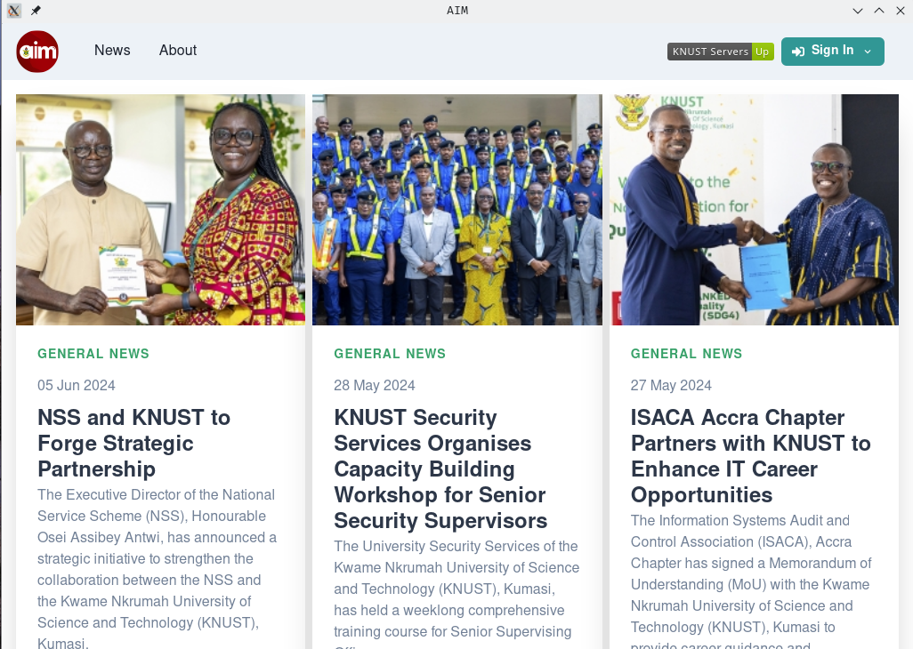

# KNUST AIM Desktop

Welcome to the KNUST AIM Desktop application! This project aims to bring the [KNUST Academic Information Management System (AIM)](https://aim.knust.edu.gh/) mobile experience to desktop.

## Security

All data is handled locally and securely by KNUST servers. No third party access to your data.

## Installation

Download the latest release of your OS from [releases](https://github.com/Owbird/KNUST-AIM-Desktop/releases)

## Contributing

We welcome contributions! To contribute:

1. Fork the repository.
2. Create a new branch (`git checkout -b feature-branch`).
3. Make your changes.
4. Commit your changes (`git commit -m 'Add some feature'`).
5. Push to the branch (`git push origin feature-branch`).
6. Open a pull request.

## Disclaimer

This project is not affiliated with or endorsed by the Kwame Nkrumah University of Science and Technology (KNUST) University Information Technology Service (UITS). It is an independent initiative created by developers for educational and research purposes.

## License

This project is licensed under the MIT License. See the [LICENSE](LICENSE) file for details.

---

We hope you find KNUST AIM Desktop useful and look forward to your contributions and feedback!
